# Aegis Refine

Agent-operated dataset refinement with capped Stripe quotes, Hermes/NVIDIA governance, NemoClaw/OpenShell sandboxed operator runs, verified spend receipts, and signed delivery proof.

[](https://stripe.com)
[](https://www.nvidia.com/en-us/ai/)
[](https://docs.nvidia.com/nemoclaw/user-guide/openclaw/home)
[](https://github.com/NousResearch)
[](https://frontierinfra.org/)
[](https://aegisrefine.com/how-it-works.html)
[](https://huggingface.co/jbrashear/Aegis-14B)
[](https://huggingface.co/jbrashear/Aegis-14B)
[](https://huggingface.co/jbrashear/Aegis-14B)

Live product: [aegisrefine.com](https://aegisrefine.com)<br>
System map for judges: [aegisrefine.com/how-it-works.html](https://aegisrefine.com/how-it-works.html)<br>
Build notes for judges: [aegisrefine.com/how-we-did-it.html](https://aegisrefine.com/how-we-did-it.html)

## What It Does

Aegis Refine turns messy training data into clean, signed datasets for fine-tuning workflows.

The customer flow is:

1. Submit or link a dataset.
2. Aegis inspects the data before payment.
3. Aegis-14B scores complexity and estimates the route/model/compute plan.
4. The app returns one capped Stripe quote.
5. The buyer accepts and pays through Stripe Checkout.
6. Hermes Agent operates the job through the `aegis-refine` skill.
7. The system produces a cleaned dataset plus an Ed25519-signed AAR certificate.
8. Receipts record quote, cap, spend, route, model stack, and delivery proof.

The quote card intentionally shows the planned route before payment: data shape, estimated compute, model stack, cleanup steps, and the maximum capped charge.

## Hackathon Fit

Aegis Refine was built for the Hermes Agent Accelerated Business Hackathon:

- **Hermes Agent** runs the operator workflow through a custom `aegis-refine` skill.
- **NVIDIA NemoClaw / OpenShell** runs the Hermes operator path inside sandboxed infrastructure when `HERMES_OPERATOR_RUNTIME=nemoclaw`.
- **NVIDIA / Nemotron** provides the operations model path and safety-gate story.
- **[Aegis-14B](https://huggingface.co/jbrashear/Aegis-14B)**, a LoRA fine-tune of `NousResearch/Hermes-4-14B`, performs data-governance judgment.
- **Stripe Checkout** is the earn rail: the customer pays the capped quote.
- **Stripe Connect Transfers** are the spend rail: when outbound spend is approved, Aegis records execution only after Stripe verification.
- **Frontier Infra standards** inform the receipt/proof surfaces: AVL, AAR, and ADL-style auditability.

## Architecture

```mermaid
flowchart LR
  Buyer["Buyer"] --> Quote["Quote request"]
  Quote --> Inspect["Data inspection"]
  Inspect --> Aegis["Aegis-14B governance"]
  Aegis --> Plan["Route + model + compute plan"]
  Plan --> Price["Capped quote"]
  Price --> Checkout["Stripe Checkout"]
  Checkout --> Job["Paid job"]
  Job --> Sandbox["NemoClaw/OpenShell sandbox"]
  Sandbox --> Hermes["Hermes Agent + aegis-refine skill"]
  Hermes --> Run["Refine / synthesize / verify"]
  Run --> Spend{"Outbound spend needed?"}
  Spend -- no --> Cert["Signed AAR + dataset"]
  Spend -- yes --> Gate["Cap gate"]
  Gate --> Transfer["Stripe Connect Transfer"]
  Transfer --> Verify["Backend verifies Stripe object"]
  Verify --> Cert
```



The customer-facing architecture page renders this as Mermaid diagrams with model roles, money rails, and fail-closed rules:

[https://aegisrefine.com/how-it-works.html](https://aegisrefine.com/how-it-works.html)

## Live Capabilities

- Deployed FastAPI application at `aegisrefine.com`.
- Stripe test-mode Checkout for capped customer payments.
- Stripe Connect test-mode transfer verification for agent-initiated spend.
- NemoClaw/OpenShell sandbox `aegis-hermes` on the Dell R750, with Hermes Agent and the `aegis-refine` skill installed.
- Operator receipts include `operator_runtime.mode=nemoclaw`, sandbox name, and the runtime-configured NVIDIA inference model.
- Dataset parsing, curation, PII masking, and validation pipeline.
- Signed quote tokens with 15-minute expiry.
- Ed25519-signed AAR certificates and public verification endpoints.
- Job ownership checks for customer downloads and order views.
- Telegram operator receipts from Hermes for completed jobs.
- Backend regression suite: `74 passed`.

Stripe objects are test-mode objects and are labeled honestly as such; the Hermes/NemoClaw/OpenShell operator path is live infrastructure for the demo.

## Implementation Map

Start here to trace the product workflow from demo claim to implementation.

| Claim | Code to inspect |
|---|---|
| Customer submits a dataset before payment | `backend/app/routers/jobs.py` -> `POST /jobs/upload`, `POST /jobs/quote` |
| Quote is based on inspected data | `backend/app/services/quote_service.py` -> `_sample_features()`, `quote_job()`, `price_quote()`, `_quote_plan()` |
| Checkout charges exactly the signed cap | `backend/app/routers/jobs.py` -> `POST /jobs/` |
| Stripe creates the paid job | `backend/app/routers/webhooks.py`, `backend/app/services/job_service.py` |
| Hermes Agent handoff | `backend/app/services/hermes_operator.py` -> `dispatch_job()` |
| NemoClaw/OpenShell operator runtime | `hermes/operator_bridge.py` -> `HERMES_OPERATOR_RUNTIME=nemoclaw`; `documents/HERMES_AGENT_INTEGRATION.md` |
| Hermes skill definition | `hermes/aegis-refine/SKILL.md` |
| Hermes prompt template | `hermes/aegis-refine/templates/operator-prompt.md` |
| Hermes-created Stripe spend | `hermes/aegis-refine/scripts/create_stripe_transfer.py` |
| Backend verifies spend before execution | `backend/app/routers/admin.py` -> `POST /admin/gate/{ticket_id}/execute`; `backend/app/services/stripe_spend.py` |
| Spend ledger and audit events | `backend/app/services/spend_service.py`, `backend/app/models/spend_ticket.py`, `backend/app/models/audit_log.py` |
| Dataset cleanup engine | `backend/app/curate/`, `backend/app/services/refinery.py` |
| Signed AAR certificate | `backend/app/services/aar_service.py`, `backend/app/models/audit_certificate.py` |
| Customer download and AAR endpoints | `backend/app/routers/downloads.py`, `backend/app/routers/jobs.py` |
| Admin receipt bundle | `backend/app/routers/admin.py` -> `GET /admin/jobs/{job_id}/receipt` |

### Agent Handoff Mechanism

The web app does not expose a terminal and does not ask the browser to impersonate Hermes.

1. A paid job enters the backend pipeline.
2. The backend builds a bounded job payload in `backend/app/services/hermes_operator.py`.
3. The payload includes job id, phase, source kind, quote/cap, Stripe Checkout session id, current spend tickets, and receipt context.
4. The backend sends that payload to the private `HERMES_OPERATOR_URL` with `HERMES_OPERATOR_TOKEN`.
5. The private bridge runs Hermes locally by default or through `nemohermes aegis-hermes exec -- ...` when NemoClaw mode is enabled.
6. Hermes Agent loads `hermes/aegis-refine/SKILL.md`, operates the job, and returns a JSON operator receipt.
7. The backend stores that receipt in the audit log as `hermes_operator_decision`.
8. If the phase is `spend_approved`, Hermes can create a Stripe Connect Transfer through `hermes/aegis-refine/scripts/create_stripe_transfer.py`.
9. The backend independently retrieves the returned `tr_...` from Stripe before marking the spend ticket executed.

The important boundary: the agent may initiate spend, but it cannot self-certify spend. Execution requires backend verification against Stripe.

### NemoClaw / OpenShell Runtime

The Dell R750 now has a NemoClaw/OpenShell sandbox named `aegis-hermes` with Hermes Agent and the `aegis-refine` skill installed.

The bridge supports:

```bash
HERMES_OPERATOR_RUNTIME=local      # default direct Hermes bridge
HERMES_OPERATOR_RUNTIME=nemoclaw   # sandboxed Hermes through nemohermes
```

In NemoClaw mode the bridge wraps the operator command as:

```bash
nemohermes aegis-hermes exec -- hermes --skills aegis-refine -z '<bounded job payload>'
```

Receipts include runtime evidence:

```json
{
  "operator_runtime": {
    "mode": "nemoclaw",
    "runtime": "NemoClaw / nemohermes",
    "sandbox": "aegis-hermes",
    "inference_model": "nvidia/llama-3.3-nemotron-super-49b-v1.5"
  }
}
```

This path uses OpenShell policy enforcement and NemoClaw's `inference.local` broker so provider credentials stay host-managed rather than being injected into the sandbox. GPU passthrough is documented as a follow-up: the host detects the NVIDIA A40, but OpenShell sandbox GPU mode still needs NVIDIA Container Toolkit/CDI setup.

### Spend Verification Rules

Outbound spend is treated as unverified unless all of these are true:

- the id starts with `tr_`;
- Stripe retrieves the Transfer successfully;
- amount is at or below the approved cap;
- destination equals `STRIPE_AGENT_SPEND_VENDOR_ACCOUNT`;
- the receipt records Stripe's own `livemode` value;
- duplicate retries use an idempotency key shaped like `<job_id>:ticket-<ticket_id>`.

Failure routes to `temporarily_queue`; the code does not synthesize transfer ids.

## Pricing / Quote Logic

Quotes are data-driven. The quote engine samples the data, asks Aegis-14B for complexity, estimates compute, applies the margin/cap ledger, then returns one capped price.

Examples from the current quote curve:

| Scenario | Result |
|---|---:|
| 1,319 clean JSONL records | about `$15` |
| 10,000 clean JSONL records | about `$30` |
| 100,000 messy tabular/PII records | about `$250` |
| OCR-heavy scanned records | about `$610` |

## Repo Map

| Path | Purpose |
|---|---|
| `backend/app/routers/jobs.py` | Quote, Checkout, sync, job API, download/AAR entry points |
| `backend/app/services/quote_service.py` | Data-driven quote math and signed quote tokens |
| `backend/app/services/refinery.py` | Job processing, curation, certificate issuance |
| `backend/app/curate/` | Deterministic dataset parsing, cleaning, PII masking, validation |
| `backend/app/services/stripe_spend.py` | Stripe spend verification before execution |
| `backend/app/services/hermes_operator.py` | Bridge from the web app to Hermes Agent |
| `hermes/operator_bridge.py` | Private bridge that can run Hermes locally or through NemoClaw/OpenShell |
| `hermes/aegis-refine/SKILL.md` | Hermes Agent skill used to operate jobs |
| `hermes/aegis-refine/scripts/create_stripe_transfer.py` | Agent-side Stripe Connect Transfer creation |
| `hermes/aegis-refine/templates/operator-prompt.md` | Prompt template for operating a job through Hermes |
| `backend/web/` | Static production web UI served by the backend |
| `backend/tests/` | Backend regression tests |

## Running Tests

```bash
cd backend
PYTHONPATH=. pytest tests -q
```

From the repo root:

```bash
PYTHONPATH=backend pytest backend/tests -q
```

Expected current result:

```text
74 passed
```

## Local Development

```bash
cd backend
python -m venv .venv
. .venv/bin/activate
pip install -r requirements.txt
uvicorn app.main:app --reload
```

Create `backend/.env` from `backend/.env.example`. Do not commit real secrets.

Core environment variables:

| Variable | Purpose |
|---|---|
| `DATABASE_URL` | Postgres connection |
| `STRIPE_SECRET_KEY` | Stripe test/live secret key |
| `STRIPE_WEBHOOK_SECRET` | Stripe webhook verification secret |
| `STRIPE_AGENT_SPEND_VENDOR_ACCOUNT` | Expected Connect destination for agent spend |
| `SECRET_KEY` | App/session signing |
| `AINODE_API_URL` | Aegis-14B compatible API endpoint |
| `AINODE_MODEL` | Usually `Aegis-14B` |
| `HERMES_OPERATOR_URL` | Private Hermes operator bridge |
| `HERMES_OPERATOR_TOKEN` | Shared bridge token |
| `HERMES_OPERATOR_RUNTIME` | `local`, `nemoclaw`, or `openshell` operator mode |
| `NEMOCLAW_SANDBOX` | NemoClaw sandbox name, usually `aegis-hermes` |
| `NEMOCLAW_INFERENCE_MODEL` | Runtime-configured NVIDIA model recorded in receipts |

## Collaboration

Aegis Refine is open for collaborators. The useful work ahead is bigger than one repo and one builder: better model evaluations, harder dataset fixtures, more Hermes skills, spend/receipt adapters, UI polish, and Frontier Infra standards for agent-readable proof.

If this overlaps with what you are building, open an issue, fork the repo, or reach out through the hackathon Discord/X thread. The goal is not just to ship a demo; it is to find people who want to build practical, verifiable agent systems together.

## License

Code and documentation in this repository are released under the MIT License. See [`LICENSE`](LICENSE).

## Honest Limitations

- Stripe is demonstrated in test mode for the hackathon.
- Completed jobs created before the pricing fix may still show their original paid quote.
- Some older docs remain as project history; this README, the live How It Works page, and the live How We Did It page are the judge-facing entry points.
- Local-only jobs can complete with zero external spend; outbound spend only appears when the job route needs it and a verified Stripe object exists.

## Infrastructure And Related Work

This project sits inside a larger agent/business-ops stack. Public links are included where available; private lab pieces are described by the role they play so reviewers can understand the system boundary without exposing credentials or internal network details.

| Project / System | Role in Aegis Refine |
|---|---|
| [Aegis Refine](https://github.com/webdevtodayjason/aegisrefine) | This repo: customer intake, data inspection, quote generation, Stripe Checkout, job execution, receipt surfaces, downloads, and signed AAR proof. |
| `hermes/aegis-refine` | The Hermes Agent skill shipped in this repo. It defines the operator protocol, spend route, receipt schema, and Telegram receipt behavior used by the demo. |
| [Hermes Agent](https://github.com/NousResearch) | Agent runtime used as the business operator. Hermes receives bounded job payloads from Aegis and operates the job through the `aegis-refine` skill. |
| [NVIDIA NemoClaw](https://docs.nvidia.com/nemoclaw/user-guide/openclaw/home) / OpenShell | Sandboxed operator runtime. The Dell R750 hosts `aegis-hermes`, where Hermes Agent can run the same `aegis-refine` skill through `nemohermes exec`; receipts record the sandbox and inference route. |
| [Frontier Infra](https://frontierinfra.org/) | Standards and design influence for agent-verifiable business operations: AVL-style visibility, AAR-style attestations, and ADL-style decision/audit logs. |
| [AINode](https://ainode.dev/) | Clustered NVIDIA/DGX Spark environment around the project. Aegis-14B is served through this infrastructure, and AINode compute is the modeled vendor for agent spend. |
| [Aegis-14B](https://huggingface.co/jbrashear/Aegis-14B) | Public Hugging Face LoRA fine-tune of `NousResearch/Hermes-4-14B` for dataset quality, risk, route, and signing decisions. Served through the local NVIDIA/DGX Spark environment. |
| NVIDIA / Nemotron | Operations and safety model stack: `nvidia/nemotron-3-ultra-550b-a55b` for higher-level routing/spend decisions, `nvidia/nemotron-3-nano-30b-a3b` as latency fallback, and `nvidia/nemotron-3.5-content-safety` for safety-gate review when evidence is available. |
| Stripe Checkout | Earn rail. The customer pays the exact signed capped quote before work starts. |
| Stripe Connect Transfers | Spend rail. Hermes may initiate a transfer for approved outbound spend; Aegis independently verifies the Stripe object before recording execution. |
| Coolify | Deployment path for the live FastAPI/static web app on the Dell R750 environment. |
| Telegram / Hermes Gateway | Operator receipt channel used in the demo. Receipts include job id, quote/cap, route, model stack, and proof links, never raw customer data. |

The [Aegis-14B model card](https://huggingface.co/jbrashear/Aegis-14B) is also part of the public evidence trail: it identifies `NousResearch/Hermes-4-14B` as the base model, marks the artifact as a LoRA adapter, and has already started receiving organic discovery through Hugging Face's Hermes model graph.

Additional project notes live in [`documents/`](documents/):

- [`documents/HERMES_AGENT_INTEGRATION.md`](documents/HERMES_AGENT_INTEGRATION.md) - deeper Hermes/Nemotron/Stripe operator integration notes.
- [`documents/HUGGINGFACE_MODEL_CARD.md`](documents/HUGGINGFACE_MODEL_CARD.md) - cleaned Aegis-14B model card, ready to publish to Hugging Face.
- [`documents/QUOTE_ENGINE.md`](documents/QUOTE_ENGINE.md) - quote curve, pricing rules, and capped quote examples.
- [`documents/API_CONTRACT.md`](documents/API_CONTRACT.md) - backend API shape.
- [`documents/CURATION_PLAN.md`](documents/CURATION_PLAN.md) - dataset refinement and AAR proof plan.

Some older handoff/state-audit documents are retained under [`documents/`](documents/) as project history. The current judge-facing sources are this README, the live [How It Works](https://aegisrefine.com/how-it-works.html) page, the live [How We Did It](https://aegisrefine.com/how-we-did-it.html) page, the `backend/app/` implementation, and the `hermes/aegis-refine/` skill.
